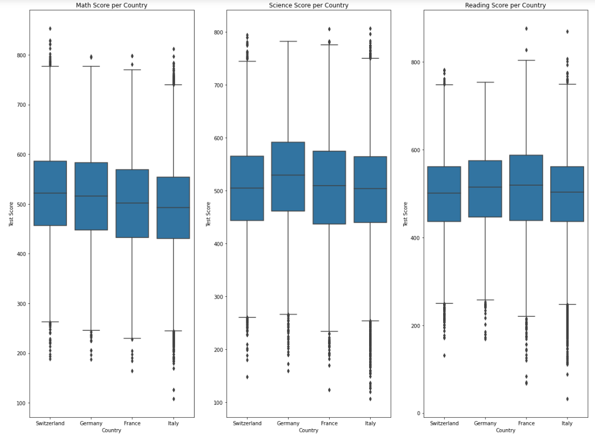
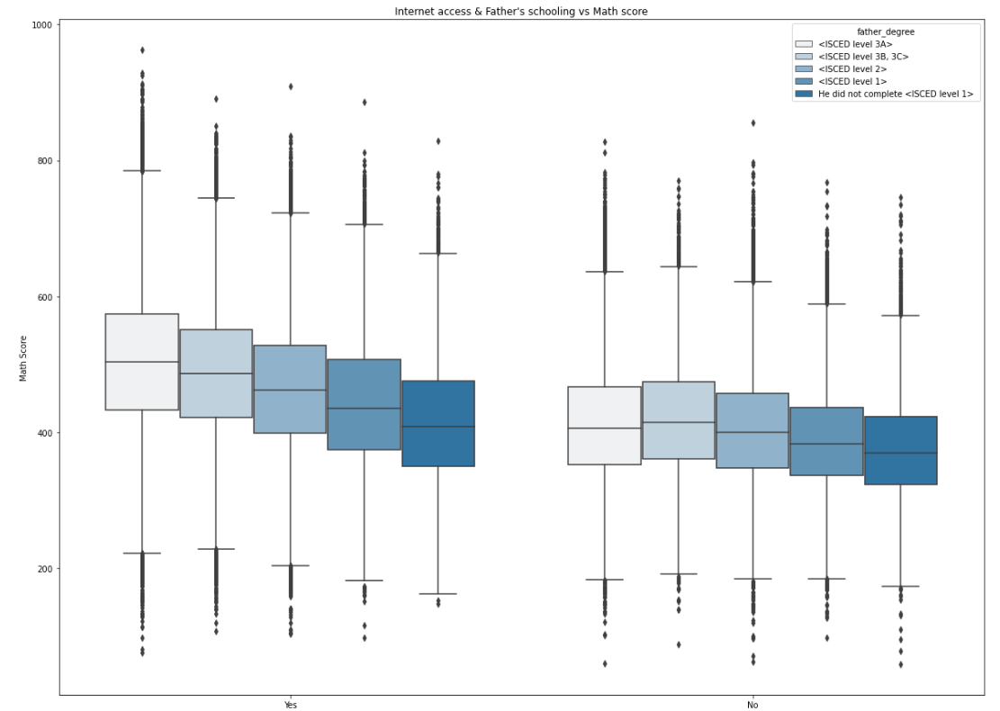
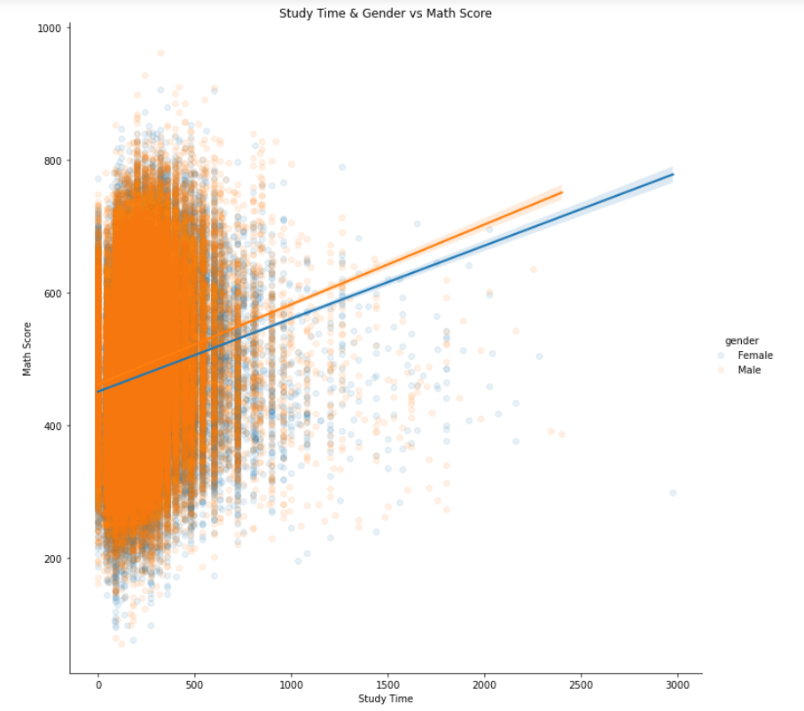

# Pisa Study 2012
## by Luca Brandt

## PISA study 2012

The PISA (Programm for International Student Assessment) measures 15-year-olds abilities in math, reading and science all over the world. The data contains responses from individual students, school principals and parents. 
The original PISA 2012 dataset contained information from 485,490 students and 636 features. For my analysis I used only a couple of variables. The most importent ones are: Country, gender, math score, reading score, science score, study time and parent's schooling.    
In this investigation I examined which variables have an impact on the scores and how the countries compare to each other.

### Data
The data can be found here: https://www.oecd.org/pisa/data/

## Summary of Findings

1. Here we can see where how many test were taken. Mexico, Italy and Spain took most tests. Meanwhile Lichtenstein hardly even participated. (probably due to their small population)
2. There are slightly more girls than boys who took the test.
3. All test scores seem more or less normally distributed but there is some variation and a little bit of skew.
4. Most kids study between 100 and 400 minutes per week.
5. Most of the parents completed ISCED level 3A. Only a couple of them did not finish ISCED level 1. In general, the distribution of fathers and mothers look very similar.
6. Fortunately the vast majority of the students have internet access.
7. Unfortunalty, it seems that kids from lower academic backgrounds do not as good in math as the ones from families with higher schooling.
8. In Poland and Slovenia they study put the least amount of time in for studying.
9. Shanghai China is clearly best at math. Countries from South America, like Argentinia and Columbia, are a little bit behind.
10. In general, all those countries perform rather similar. For math the swiss excels, in science it's germany and for reading there is hardy a difference between the countires.
11. Except for a few outliers in the 'yes' variable, the students with internet access do better in the all the tests.
12. In general the math score gets higher with more time spent studying.
13. The higher the father's schooling and with Internet access, the better the student does at the math test.
14. Boys and girls can improve their grades equally well with more studying.

## Key Insights for Presentation

### Test scores for selected countries
{:height="36px" width="36px"}

In general, all those countries perform rather similar. For math the swiss excels, in science it's germany and for reading there is hardy a difference between the countires.  
It seems that Italy has more outliers in the low scores than the other countries in each test. That must reduces their average quiet a bit. It might make sence for the schools in Italy to focus a little bit more on students that struggle to help them improve.

### Internet access and Father's education vs Math Score

We can see that the higher the father's schooling and with Internet access, the better the student does at the math test. There is only one exception. When the kid does not have internet access and the father's schooling is ISCED level 3B, 3C the mean is higher than for students with fathers with ISCED level 3A education. The very best ones, the outliers, are still better when the father has a higher education.  
Also, it seems that internet access is more importent than the father's education. All the groups with internet performed better than the ones without, regardless of the father's schooling. But again, that is very likly the sum of other factors as well.  
The best chances to succeed has a student with internet access and a father with the highest schooling possible. Reversely, a student without internet access and a father with low education is likly to score not quiet as high as the other groups.

### Study Time & Gender vs Math Score

Boys and girls can improve their grades with more studying. The graphs are almost parallel thus males and females can increase their math score almost equally well with more studying.  
So the biggest difference is that boys simply score higher in math.

